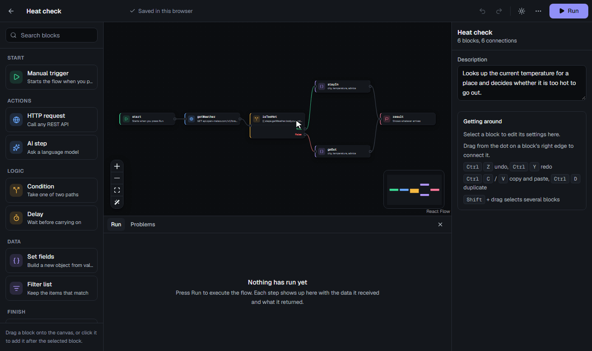
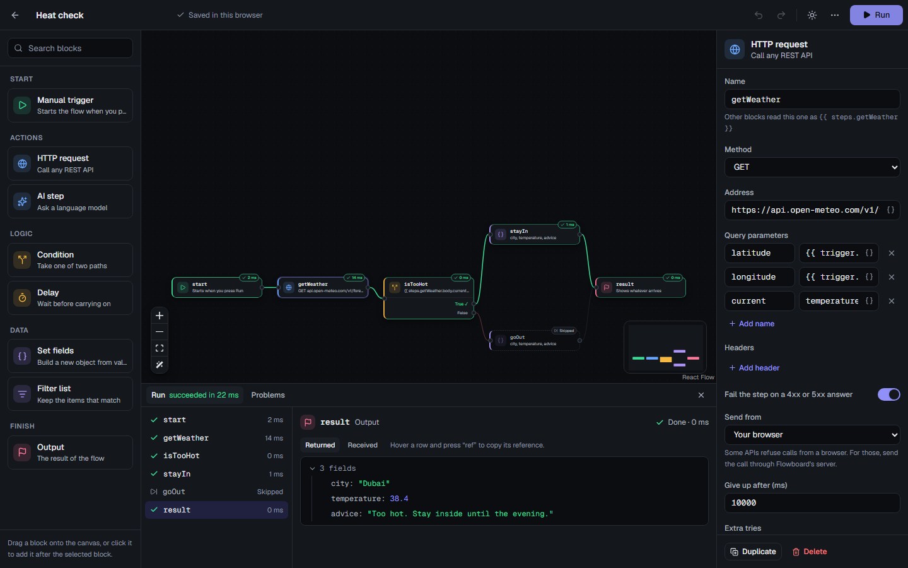
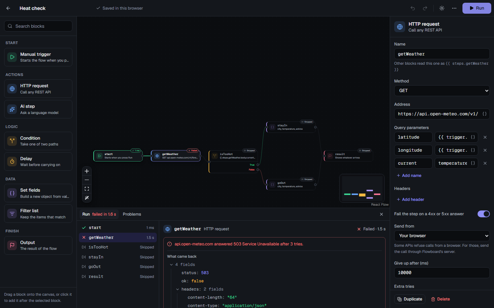
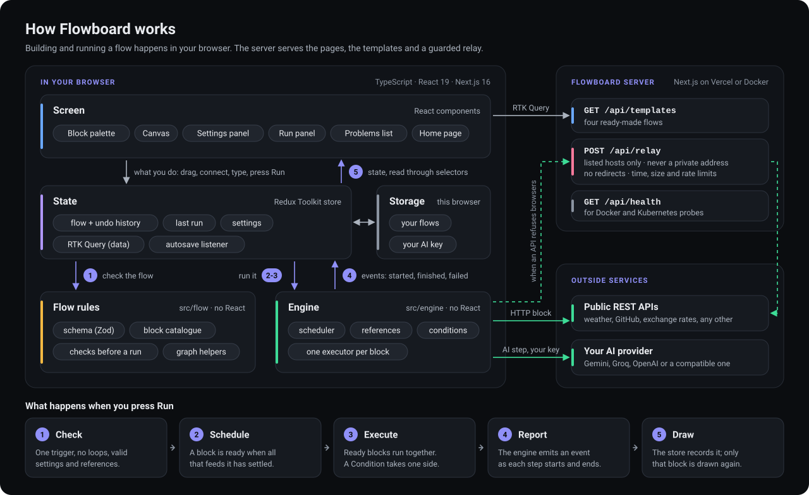
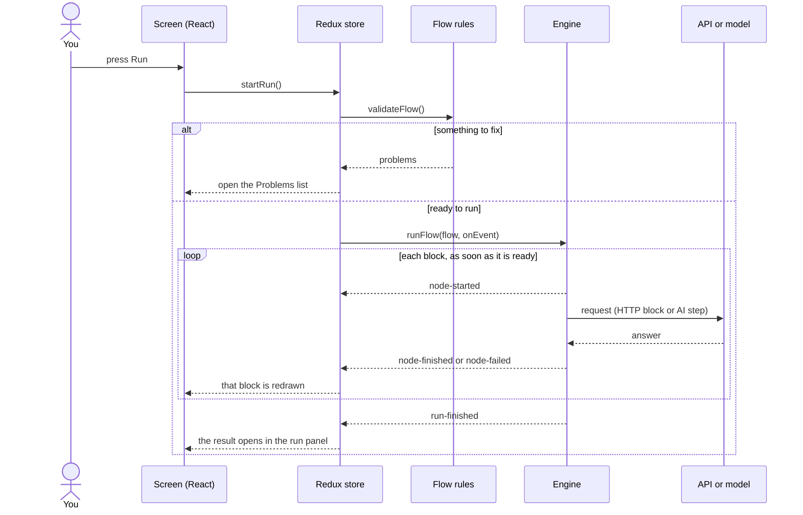

# Flowboard

A visual workflow builder. Drag blocks onto a canvas, connect them, press Run, and watch each step execute with its real data. Think of it as a small n8n that runs entirely in your browser.

**Live demo: https://flowboard-flax-seven.vercel.app**

[](https://github.com/f20230125-sudo/flowboard/actions/workflows/ci.yml)



Built with Next.js 16, React 19, Redux Toolkit and TypeScript.

## Try it in a minute

1. Open the [live demo](https://flowboard-flax-seven.vercel.app) and pick **Heat check**.
2. Press **Run**. The flow calls a real weather API, checks the temperature, and takes one of two paths.
3. Click any block to see what it received and what it returned.
4. Change `limit` in the trigger's sample data to `10` and run again. The other path lights up.

Nothing to install, no account, no key.



## What it does

- **Eight blocks:** manual trigger, HTTP request, condition, set fields, filter list, AI step, delay, output.
- **A real engine:** Run executes the flow. Blocks that are ready at the same time run together, a condition sends data down one side only, and a failed step stops the run and shows what the server said.
- **Requests that cope with a busy API:** an HTTP request can be given extra tries. It calls again after a 429, 502, 503 or 504, or when no answer comes in time, waiting longer before each try, and the run panel says which try worked.
- **Data between blocks:** a field can read another block's result with `{{ steps.getWeather.body.current.temperature_2m }}`. You do not have to type that: each such field lists the data of the steps before it, and pressing "insert" on a value puts its reference where the cursor was.
- **An editor that forgives:** undo and redo for everything, copy and paste between flows, autosave, renaming a block rewrites every reference to it, and Tidy up lines the blocks up in the order they run.
- **Checks before a run:** one trigger, no loops, required settings, references to blocks that do not exist or do not run first. Each problem is listed in plain words and marked on its block.
- **Flows you can move:** export to a file, import it back, or copy a share link that carries the whole flow in the address.
- **Light and dark themes**, and keyboard shortcuts for what you do often (press `?` in the editor).
- **AI at no cost to anyone but you:** the AI step uses your own key for Gemini, Groq, OpenAI or any compatible service. Without a key it returns a sample reply, labelled as a sample. A model that answers "busy" is asked again, and one that does not answer within a minute is given up on, with a message that says what to do.



## How it works



Read it from the top. What you do on the screen becomes actions in the store, and the screen redraws from the store's state. The canvas keeps no copy of the flow: it is told what to show.

The numbers on the arrows are the steps of a run, listed along the bottom of the picture:

1. **Check.** The store asks the flow rules whether the flow can run. If not, the Problems list opens and nothing runs.
2. **Schedule.** The engine works out which blocks are ready: those whose inputs have all settled.
3. **Execute.** Ready blocks run together. An HTTP block calls its API straight from the browser, or through the relay when the API refuses browsers. An AI step calls your provider with your key.
4. **Report.** The engine does not touch the screen. It emits an event as each step starts, finishes or fails.
5. **Draw.** The store records each event, and only the block it concerns is drawn again.

The same run as a conversation between the parts:



Six decisions shape the code.

**1. The engine knows nothing about React.** [`src/engine`](src/engine) takes a flow and reports what happens through events. The UI only listens. That is why the scheduler, the references and every block are tested without a browser, and why the engine could move behind a backend service without changing its contract.

**2. A flow cannot run code.** A reference is a path lookup and nothing else ([`reference.ts`](src/engine/reference.ts)), and a condition is one of a fixed list of comparisons ([`condition.ts`](src/engine/condition.ts)). There is no `eval` and no expression language. This is what makes it safe to open a flow from a share link or a file.

**3. Undo is written by hand.** [`flowSlice.ts`](src/store/flowSlice.ts) keeps snapshots of the document. Immer shares the unchanged parts between them, so a hundred steps of history cost little more than one copy. A whole drag is one step, typing in a field is one step, and selection is not part of the history at all.

**4. One block, one catalogue entry.** [`catalog.ts`](src/flow/catalog.ts) describes each block: its name, its group, its connection points and its settings. The palette, the block on the canvas and the settings form are all drawn from it. Adding a block means adding an entry there and an executor in [`executors.ts`](src/engine/executors.ts).

**5. Storage sits behind an interface.** Flows are saved in the visitor's browser, so the demo needs no database and no accounts. The app only talks to [`FlowRepository`](src/storage/repository.ts); a REST backend would be one more class.

**6. Everything from outside is checked.** Browser storage, imported files, share links, templates and the clipboard all pass through the same Zod schema ([`schema.ts`](src/flow/schema.ts)) before the app trusts them.

### State

| Piece | Tool | Why |
|---|---|---|
| The open flow, undo history, the last run, settings | Redux Toolkit slices | One source of truth that the canvas, the panels and the engine all share |
| Templates, the list of saved flows | RTK Query | Caching, loading and error states, and refetching after a change |
| Autosave | RTK listener middleware | Each change restarts a short wait, so a burst of edits is one save |
| Theme, toasts | React Context | Small, app-wide, unrelated to the flow |

The canvas is [React Flow](https://reactflow.dev) run as a controlled component: it holds no state of its own, and every move, selection and connection goes through the store.

## The REST API

| Route | What it does |
|---|---|
| `GET /api/templates` | The ready-made flows, as summaries |
| `GET /api/templates/:id` | One ready-made flow, complete. `404` with `{ error: { code, message } }` when there is none |
| `POST /api/relay` | Makes one HTTP request for you and returns the answer |
| `GET /api/health` | Answers when the server is up. Used by the Docker health check and the Kubernetes probes |

### Why the relay is closed by default

Some APIs refuse calls from a browser. For those, the HTTP block can send its request through `/api/relay`. A server that fetches any address it is handed is a well-known hole (server-side request forgery), so the relay:

1. only calls hosts on a short list,
2. never calls a private or local address, whatever the list says, and checks what a name resolves to,
3. does not follow redirects,
4. caps how long it waits, how much it reads, and how often one visitor may use it,
5. drops headers that belong to the visitor's session.

The rules are in [`src/server/relay.ts`](src/server/relay.ts), with tests for each one. One limit is stated in the code: a host name is resolved once to check it and again when the request is made, so the host list is what really keeps the hosted relay closed.

## Run it yourself

```bash
npm install
npm run dev          # http://localhost:3020
```

With Docker:

```bash
docker compose up --build     # http://localhost:3000
```

The image is built in three stages and runs the self-contained Next.js server as a user without root rights.

On Kubernetes:

```bash
docker build -t flowboard:local .
kind load docker-image flowboard:local   # only on a kind cluster, which cannot see local images
kubectl apply -f deploy/k8s.yaml
kubectl port-forward service/flowboard 3000:80
```

Flows live in each visitor's browser, so the server keeps nothing and any number of copies can run side by side.

Settings for your own copy:

| Variable | Effect |
|---|---|
| `RELAY_ALLOWED_HOSTS` | Comma-separated hosts the relay may call, replacing the built-in list |
| `RELAY_ALLOW_ALL=1` | Lets the relay call any public host. Private addresses are still refused |

## Tests

```bash
npm test             # 302 unit tests (Vitest)
npm run e2e          # 33 end-to-end tests (Playwright)
npm run lint
npm run typecheck
```

No test touches the network. Unit tests hand the engine a stand-in for `fetch`; end-to-end tests answer the public APIs themselves.

- **Engine:** ordering, branches, parallel paths, the limit on blocks running at once, stop, failure, loops, and every block on its own, including when a request tries again and when it does not.
- **Editor:** undo and redo, a drag as one step, merged typing, renaming with references, copy and paste, autosave, and the tidy-up layout.
- **Safety:** references that try to reach into JavaScript itself, the relay's refusals, files and links that are not flows.
- **End to end:** build a flow by clicking and by dragging, insert a value from an earlier step, tidy the layout, run it, watch it fail, watch a busy API be asked again, export and import it, open a share link in a second browser, set a key and see the model called, run a flow on a phone-sized screen.
- **Accessibility:** an automated scan (axe) of the home page, the editor, the list of values to insert and the settings dialog, in the light and the dark theme. It checks labels, roles and colour contrast, and must find nothing.
- **Speed:** checked by hand with a flow of 100 blocks: it opens in about a third of a second and dragging a block holds 60 frames a second, because moving a block redraws only that block.

CI runs all of it on every push, then builds the Docker image, starts a container, waits for its health check, and calls its routes. Last, it starts a one-node Kubernetes cluster ([kind](https://kind.sigs.k8s.io)), applies the manifest, waits until both copies of the app pass their probes, and calls the app through the Service.

## Layout

```
src/app/          pages and REST route handlers
src/flow/         the saved shape of a flow, the block catalogue, validation, graph helpers, the tidy-up layout
src/engine/       the scheduler, references, conditions, and one executor per block
src/store/        Redux slices, selectors, thunks, RTK Query
src/storage/      FlowRepository, the browser implementation, share links
src/server/       the relay's rules
src/settings/     AI providers and the key check
src/components/   canvas, blocks, palette, settings panel, run panel
src/templates/    the four ready-made flows
tests/e2e/        Playwright
deploy/           the Kubernetes manifest
```

## Limits

- There are no loops and no arithmetic. Filter list handles the common "for each" case; a calculation needs an API or a model.
- Flows are saved in one browser. Export or share a flow to move it.
- In CI the AI step is tested against stand-ins for the providers, because a live model needs a key. By hand, on 6 October 2026, both AI templates were run on the live site against Gemini with a free key, and each got a real reply in about a second and a half. Groq and OpenAI were checked only for what needs no key: they accept calls from a browser, and their replies to a bad key are read and shown. The starting Groq model is on Groq's current list but has not been called.
- The Docker image and the Kubernetes manifest are built and run in CI, the manifest on a one-node test cluster. It has not run on a production cluster, and it has no Ingress, TLS or autoscaling.
- Extra tries repeat the same request. They are off by default, and are meant for requests that only read: a request that creates something could create it twice.
- Editing needs a screen at least 1024 pixels wide. On a phone a flow can be opened and run, but not edited.
- The accessibility scan covers what a machine can check. Connecting two blocks still needs a pointer; the rest works from the keyboard.

## Licence

MIT
